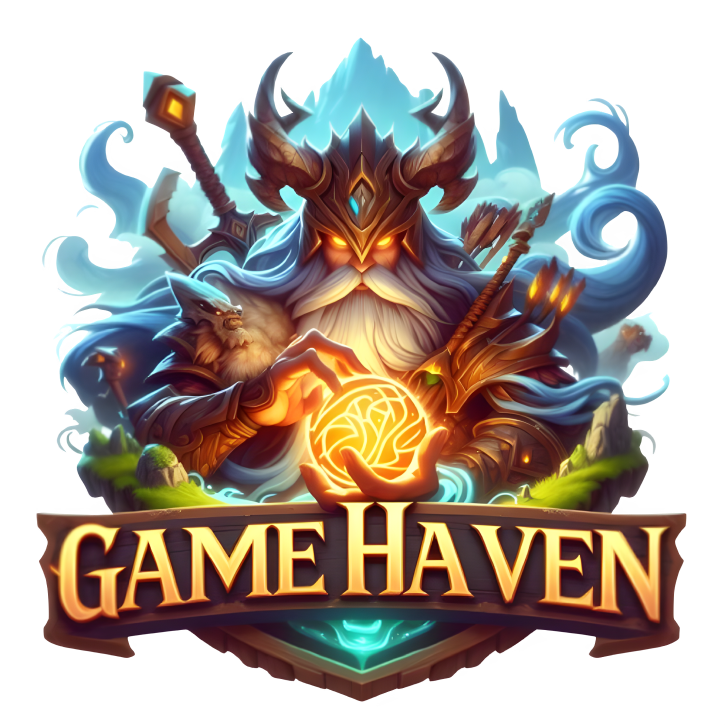

# Welcome to GH-GameHaven: Your Ultimate Gaming Destination

Greetings, gaming enthusiasts! We are thrilled to introduce you to **GH-GameHaven**, your go-to hub for discovering, connecting, and favoriting your favorite video games. Let's embark on a journey into the world of gaming like never before!



## Installation

To run the project on your own, follow these steps:

1. Get your API keys:

   [IGDB](https://api-docs.igdb.com/#getting-started)

   [Firebase](https://firebase.google.com/)

2. Install dependencies:

   ```sh
   npm install

   ```

3. Run the development server:

   ```sh
   npm run dev

   ```

4. Open your browser and navigate to [http://localhost:5173](http://localhost:5173)

## Explore the Vast Gaming Universe

At GH-GameHaven, we understand the thrill of exploring new gaming worlds. Our powerful search feature allows you to effortlessly discover a vast array of games across different genres, platforms, and themes. Whether you're into action-packed adventures, immersive RPGs, or fast-paced shooters, GH-GameHaven is your compass to navigate the gaming universe.

## Connect with Fellow Gamers

Gaming is not just a solo experience; it's a community-driven adventure. **GH-GameHaven** brings gamers together! Sign up and join a vibrant community of like-minded individuals who share your passion for gaming. Forge new friendships, exchange tips and strategies, and stay updated on the latest gaming trends. The gaming community awaits, and GH-GameHaven is your portal to connect.

## Saving Your Favorites

Found a game that resonates with you? Never lose track of your favorites again. With **GH-GameHaven**, you can effortlessly favorite and organize your most-loved games. Whether it's a nostalgic classic, an upcoming release, or a hidden gem, our platform ensures that your gaming wishlist is always just a click away.

## Why GH-GameHaven?

- **User-Friendly Interface**: Navigate through our intuitive and user-friendly interface designed with gamers in mind.
- **Comprehensive Search**: Discover games easily with our robust search functionality, filtering options, and curated recommendations.
- **Community Engagement**: Connect with a diverse community of gamers, share experiences, and be a part of the ever-expanding gaming network.
- **Favoriting Feature**: Personalize your gaming experience by favoriting and organizing your favorite titles effortlessly.

## Ready to Level Up Your Gaming Experience?

Don't miss out on the excitement! Join **GH-GameHaven** today and let the gaming adventure begin. Your favorite games are just a search away, and a community of fellow gamers is waiting to welcome you.
